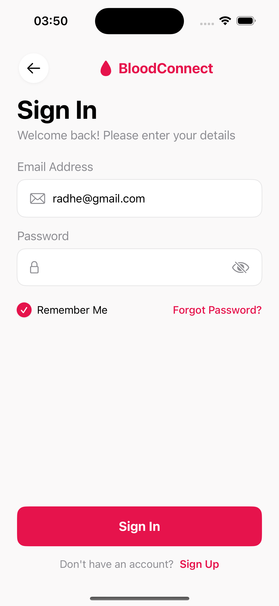
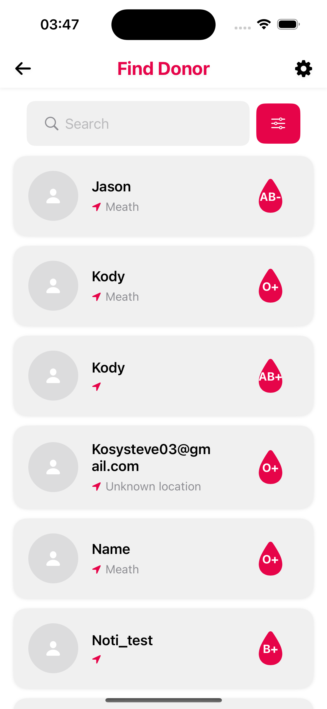
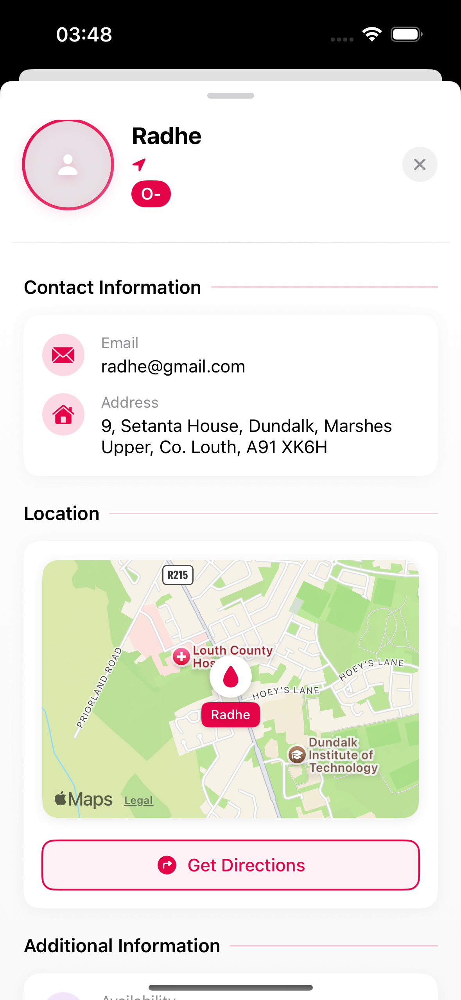
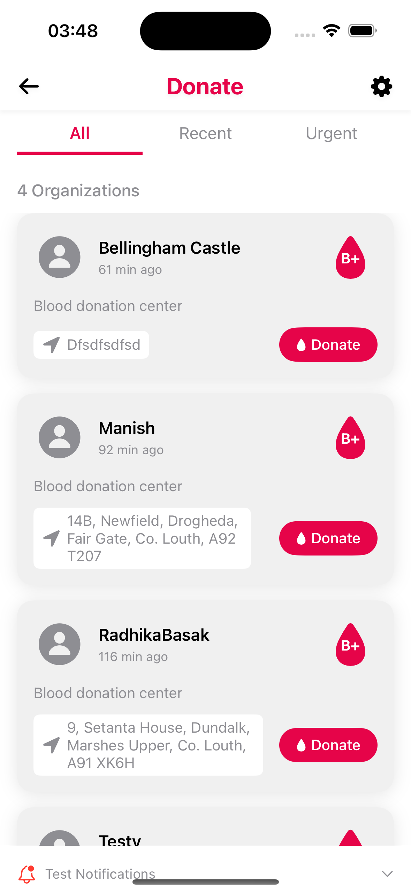
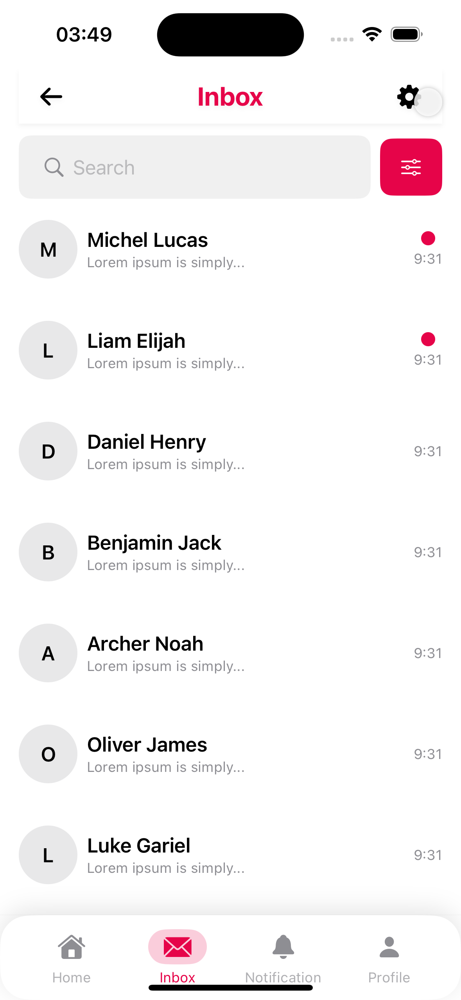
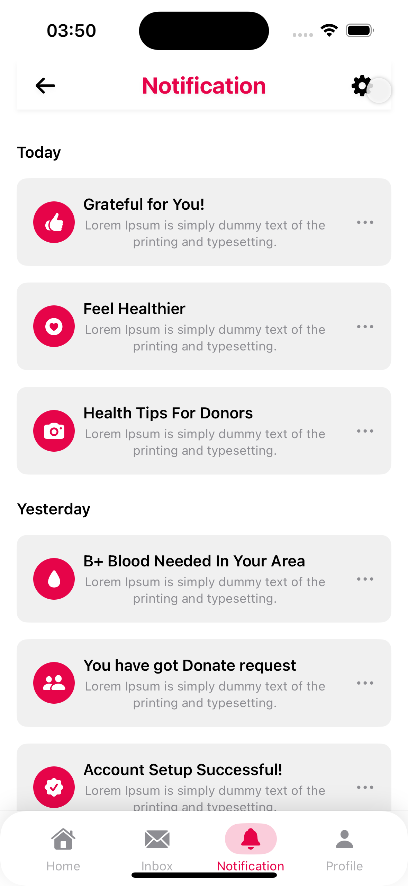
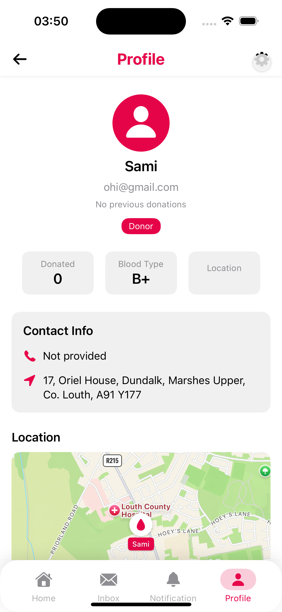

# 🩸 BloodConnect

[](https://swift.org)
[](https://developer.apple.com/ios/)
[](LICENSE)
[](https://firebase.google.com)
[](https://developer.apple.com/xcode/swiftui/)

A revolutionary iOS application that bridges the gap between blood donors and recipients, leveraging modern technology to make blood donation more accessible, efficient, and life-saving.

## 📱 User Interface Walkthrough

### 1. Authentication & Registration
BloodConnect offers two distinct registration paths to cater to different user needs:

#### For Donors

- **Purpose**: Register as a blood donor
- **Features**:
  - Personal information collection
  - Blood type specification
  - Medical history questionnaire
  - Location-based registration
  - Automatic address detection from EIR code

#### For Donation Centers

- **Purpose**: Register as a blood donation center
- **Features**:
  - Organization details
  - Center location verification
  - Operating hours setup
  - Capacity management
  - Automatic location verification

#### Login Experience

- **Features**:
  - Secure authentication
  - Role-based access
  - Remember me functionality
  - Password recovery
  - Biometric authentication support

### 2. Main Dashboard

- **Key Features**:
  - Quick access to all main functions
  - Real-time notifications
  - Recent activity feed
  - Emergency requests highlight
  - Location-based suggestions

### 3. Donor Search & Matching

- **Features**:
  - Advanced search filters
  - Location-based matching
  - Blood type compatibility
  - Availability status
  - Contact information

### 4. Donor Profiles

- **Information Displayed**:
  - Blood type
  - Donation history
  - Availability status
  - Location
  - Contact details
  - Rating and reviews

### 5. Donation Management

- **Features**:
  - Schedule donations
  - Track donation history
  - View upcoming appointments
  - Manage availability
  - Receive reminders

### 6. Communication

- **Features**:
  - Direct messaging
  - Appointment confirmations
  - Emergency alerts
  - System notifications
  - Message history

### 7. Notifications

- **Types of Notifications**:
  - Emergency requests
  - Appointment reminders
  - New messages
  - System updates
  - Donation requests

### 8. User Profile

- **Features**:
  - Personal information management
  - Donation history
  - Settings customization
  - Privacy controls
  - Account preferences

## 🌟 Features

### Core Features
- 🔍 **Smart Donor Search**: Find compatible blood donors in your vicinity
- 📱 **Real-time Notifications**: Instant alerts for blood requests
- 🏥 **Hospital Integration**: Seamless connection with local hospitals and blood banks
- 📊 **Donation Tracker**: Comprehensive history of your blood donations
- 🔐 **Secure Authentication**: Biometric and multi-factor authentication
- 📍 **Location Services**: Precise location-based donor matching
- 💬 **Messaging System**: Direct communication between donors and recipients

### Advanced Features
- 🎯 **Blood Type Matching**: Intelligent compatibility checking
- 📈 **Analytics Dashboard**: Track donation trends and impact
- 🚨 **Emergency Mode**: Priority handling for urgent requests
- 🤝 **Community Building**: Connect with regular donors
- 📅 **Scheduling System**: Easy appointment management
- 🏆 **Rewards Program**: Incentives for regular donors

## 📱 Screenshots

| Feature | Screenshot |
|---------|------------|
| Home Screen | *Coming Soon* |
| Donor Search | *Coming Soon* |
| Request Blood | *Coming Soon* |
| Profile | *Coming Soon* |

## 🏗️ Project Structure

```
BloodConnect/
├── AppDelegate.swift          # App lifecycle management
├── SceneDelegate.swift        # Scene management
├── ViewController.swift       # Main view controller
├── Models/                    # Data models
│   ├── User.swift            # User profile and authentication
│   ├── BloodRequest.swift    # Blood request management
│   ├── Donation.swift        # Donation tracking
│   └── Hospital.swift        # Hospital integration
├── Views/                     # UI components
│   ├── Authentication/       # Login and registration
│   ├── Home/                 # Main dashboard
│   ├── Profile/              # User profile
│   ├── Requests/             # Blood requests
│   └── Components/           # Reusable UI elements
├── Controllers/              # Business logic
│   ├── AuthController.swift  # Authentication logic
│   ├── BloodRequestController.swift # Request management
│   ├── UserController.swift  # User management
│   └── LocationController.swift # Location services
├── Services/                 # Network and data services
│   ├── AuthService.swift     # Authentication service
│   ├── DatabaseService.swift # Database operations
│   ├── LocationService.swift # Location handling
│   └── NotificationService.swift # Push notifications
├── Utils/                    # Helper functions
│   ├── Constants.swift       # App constants
│   ├── Extensions.swift      # Swift extensions
│   └── Helpers.swift         # Utility functions
└── Resources/                # App resources
    ├── Assets.xcassets/      # Images and assets
    └── Localization/         # Localization files
```

## 🚀 Getting Started

### Prerequisites

- Xcode 12.0 or later
- iOS 14.0 or later
- CocoaPods
- Firebase account
- Apple Developer account
- Physical iOS device (recommended)

### Installation

1. Clone the repository
```bash
git clone https://github.com/sanidhyapandey/BloodConnect.git
cd BloodConnect
```

2. Install dependencies
```bash
pod install
```

3. Open the workspace
```bash
open BloodConnect.xcworkspace
```

4. Configure Firebase
- Add your `GoogleService-Info.plist` to the project
- Enable required Firebase services:
  - Authentication
  - Firestore
  - Cloud Messaging
  - Storage
  - Analytics

5. Configure Signing
- Open Xcode project settings
- Select your team
- Update bundle identifier
- Enable necessary capabilities

## 🏛️ Architecture

The app follows the MVVM (Model-View-ViewModel) architecture pattern with the following components:

- **Models**: Data structures and business logic
- **Views**: UI components and SwiftUI views
- **ViewModels**: Business logic and data binding
- **Services**: Network and data operations
- **Repositories**: Data access layer

## 📚 API Documentation

### Authentication
```swift
// User Authentication
func signIn(email: String, password: String)
func signUp(user: User)
func signOut()
```

### Blood Requests
```swift
// Blood Request Management
func createRequest(request: BloodRequest)
func getNearbyRequests(location: CLLocation)
func updateRequestStatus(requestId: String, status: RequestStatus)
```

### Donations
```swift
// Donation Tracking
func recordDonation(donation: Donation)
func getDonationHistory(userId: String)
func updateDonationStatus(donationId: String, status: DonationStatus)
```

## 🧪 Testing

### Unit Tests
```bash
xcodebuild test -scheme BloodConnect -destination 'platform=iOS Simulator,name=iPhone 14'
```

### UI Tests
```bash
xcodebuild test -scheme BloodConnect -destination 'platform=iOS Simulator,name=iPhone 14' -only-testing:BloodConnectUITests
```

## 🚢 Deployment

1. Update version number in Xcode
2. Run tests
3. Archive the project
4. Upload to App Store Connect
5. Submit for review

## 🛠️ Built With

- [Swift](https://swift.org) - Modern, safe, and fast programming language
- [Firebase](https://firebase.google.com) - Backend services and real-time database
- [CocoaPods](https://cocoapods.org) - Dependency management
- [SwiftUI](https://developer.apple.com/xcode/swiftui/) - Modern UI framework
- [CoreLocation](https://developer.apple.com/documentation/corelocation) - Location services
- [UserNotifications](https://developer.apple.com/documentation/usernotifications) - Push notifications

## 🤝 Contributing

We love contributions! Here's how you can help:

1. Fork the repository
2. Create your feature branch (`git checkout -b feature/AmazingFeature`)
3. Commit your changes (`git commit -m 'Add some AmazingFeature'`)
4. Push to the branch (`git push origin feature/AmazingFeature`)
5. Open a Pull Request

### Code Style
- Follow Swift style guide
- Use meaningful variable names
- Add comments for complex logic
- Write unit tests for new features

## 📝 License

This project is licensed under the MIT License - see the [LICENSE](LICENSE) file for details.

## 👥 Authors

- **Sanidhya Pandey** - *Lead Developer* - [GitHub](https://github.com/sanidhyapandey)
- **Contributors** - See [contributors](https://github.com/sanidhyapandey/BloodConnect/contributors)

## 🙏 Acknowledgments

- Apple Developer Documentation
- Firebase Team
- Open Source Community
- Blood Donation Organizations
- Medical Professionals
- Beta Testers

## 📞 Contact

Sanidhya Pandey - [LinkedIn](https://linkedin.com/in/sanidhyapandey) - [Twitter](https://twitter.com/sanidhyapandey)

Project Link: [https://github.com/sanidhyapandey/BloodConnect](https://github.com/sanidhyapandey/BloodConnect)

## 📊 Statistics


 